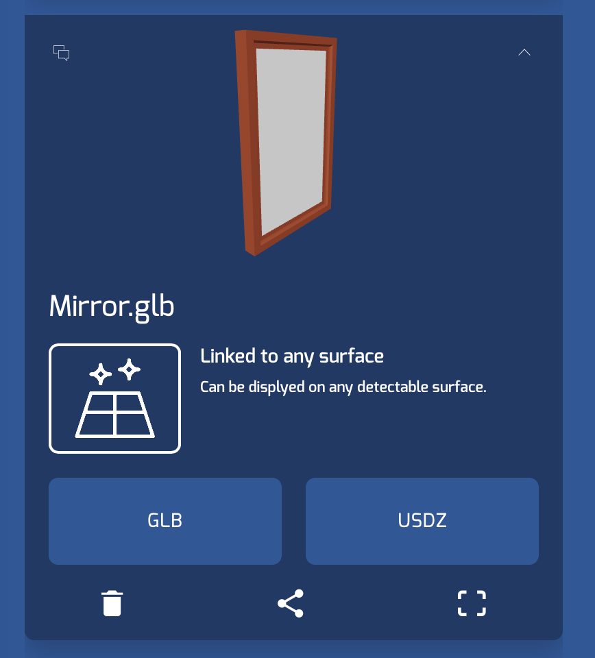

# iOS-ARKit-echo3D-demo-Wall-Art
This is a demo app that allows users to add picture from their camera roll to a vertical plane (like a wall).
The pictures are added with a picture frame, which is a 3D model brought in from echo3D.

## Register
Don't have an API key? Make sure to register for FREE at [echo3D](https://console.echo3D.co/#/auth/register).

# Setup
* Clone this project and open in Xcode 
* Set your echo3D API key in the Echo3D.swift file
* Add a picture frame model to the echo3D console (you can search and find one on the platform itself) 
* Note: this demo is using a mirror 3D model as its picture frame
* Add the entry id of your picture frame model, to the ViewController.swift file

# Run
* [Build and run the AR Application](https://docs.echo3D.co/swift/adding-ar-capabilities)
* make sure your signing and capabilities are correctly configured so you can run on device.
* connect your device to your computer (unlock it)
* select your device, and build and run.

# Learn more 
Refer to our [documentation](https://docs.echo3D.co/swift/installation) to learn more about how to use Swift and echo3D.

# Support
Feel free to reach out at <support@echo3D.co> or join our [support channel on Slack](https://go.echo3D.co/join).

# Screenshots

Demo created by [Daye Jack](https://github.com/ddj231/).
